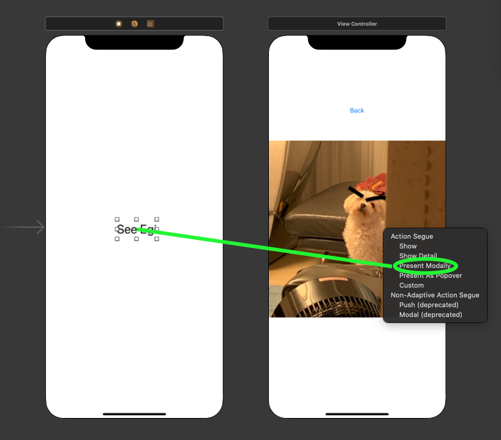
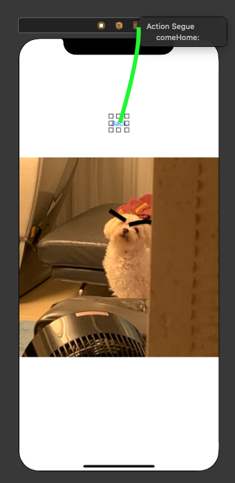

# Move between Activities
1. Segue
2. Navigation Controller

---

## Segue

1. View controller setup and link two view controllers by connecting and choosing *Present Modally*

2. create function called ```comeHome```to make a function that comes back to previous view controller

```swift
@IBAction func comeHome(_ sender: UIStoryboardSegue) {

}
```

1. link the empty function with Exit button on the top of the controller


4. **Done!**

<br>

### Programmatically

1. Link the Button with code (Action), and write below

```swift
// func that moves to next view controller.
@IBAction func toNextVC(_ sender: Any) {
    let nextVC = self.storyboard?.instantiateViewController(identifier: "nextPage")
    nextVC?.modalTransitionStyle = .flipHorizontal
    present(nextVC!, animated: true, completion: nil);
}
```
* ```"nextPage"```: destination storyboard ID
* ```.modalTransitionStyle```: style of animation movement, (flipHorizontal, coverVertical, partialCurl, crossDissolve)

2. Create custom View Controller swift file that has ```ViewController``` parent. (make sure to link!)

3. Link the ```NextViewController```'s button with the new created file. Make the ```backToHome``` function to go back

```swift
import UIKit

class NextViewController: UIViewController {

    override func viewDidLoad() {
        super.viewDidLoad()
    }
    
    @IBAction func backToHome(_ sender: Any) {
        self.dismiss(animated: true, completion: nil)
    }
}
```

:key: : if you decide to do ```animated: true``` the animation will automatically do the opposite of previous animation.

---

## Navigation Controller

from the top menu .. <br>**Editor** :arrow_right: **Embed in** :arrow_right: **Navigation Controller**

Do the same as top, but few things differently.
1. instead of Present Modally, **```Show```**
2. Can change the Navigation Item on the top by double click and simply drag and drop from library ```Navigation Item```
