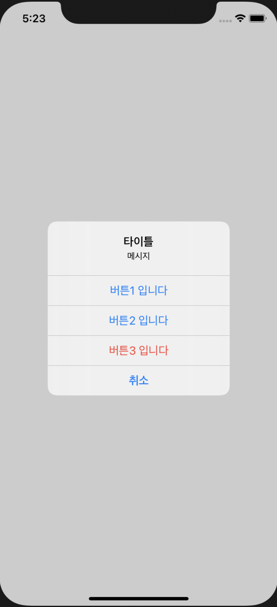
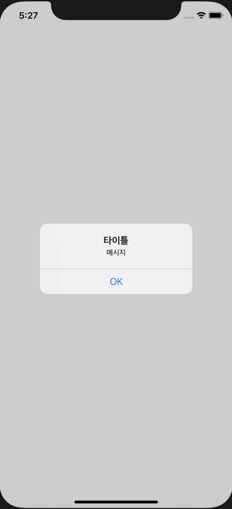
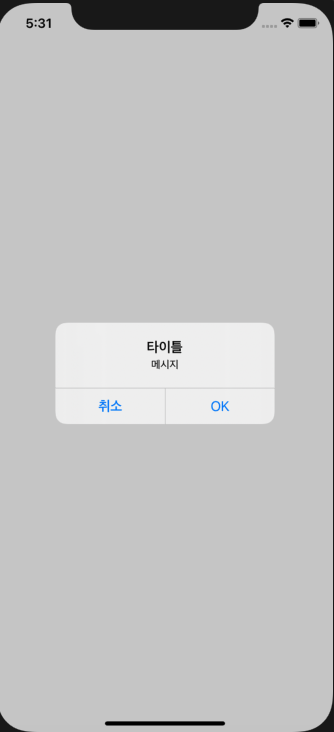
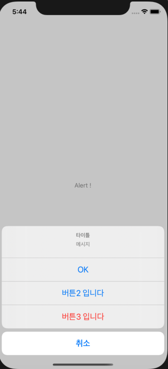
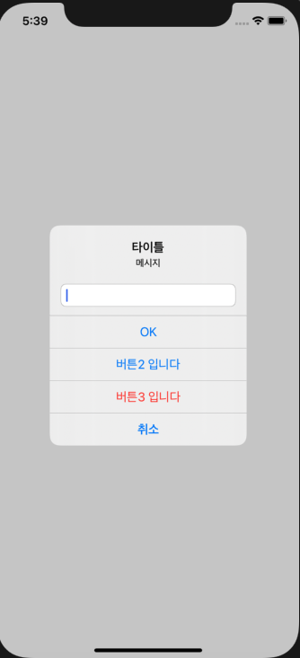

# UI Alert Controller

화면에 선택지를 표시하는 알림을 만드는 방법. 알림은 현재 뷰 컨트롤러의 화면과 함께 표시되며, 알림에는 텍스트 입력 필드를 표시할 수 도 있습니다.




---

## setup
버튼을 누를시에, UIAlertController가 나온다.

```swift
import UIKit

class ViewController: UIViewController, UITextFieldDelegate {

    override func viewDidLoad() {
        super.viewDidLoad()
        // Do any additional setup after loading the view.
    }

    @IBAction func showAlert(_ sender: Any) {
        let alert = UIAlertController(title: nil, message: nil, preferredStyle: .alert)
        alert.title = "타이틀"
        alert.message = "메시지"

        // 텍스트 필드 setup
        alert.addTextField{(textField) -> Void in
            textField.delegate = self
        }
        
        alert.addAction(UIAlertAction(title: "OK", style: .default, handler: {
            (action) -> Void in
            self.hello(action.title!)
        }))
        
        alert.addAction(UIAlertAction(title: "버튼2 입니다", style: .default, handler: {
            (action) -> Void in
            self.hello(action.title!)
        }))

        // 빨간색 버튼
        alert.addAction(UIAlertAction(title: "버튼3 입니다", style: .destructive, handler: {
            (action) -> Void in
            self.hello(action.title!)
        }))

        // 취소 버튼
        alert.addAction(UIAlertAction(title: "취소", style: .cancel, handler: nil))

        
        self.present(alert, animated: true, completion: {
            print("알람이 표시되었습니다.")
        })
    }
    func hello(_ msg: String) {
        print(msg)
    }
    
    // Text Field가 종료 되었을 시,
    func textFieldDidEndEditing(_ textField: UITextField) {
        print(textField.text!)
    }
}


```

|UIAlertAction type|description|
|-|-|
|```.default```|그냥 일반 버튼|
|```.destructive```|빨간 색 버튼|
|```.cancel```|취소 버튼 (bold)|

> ```alert.addAction```갯수에 따라 alert view 가 다르게 보이는 경우도 있다. (한개 두개)




<br><br>

:key: UIAlertController의 스타일은 ```alert```뿐 만 아니라, ```actionSheet```도 존재한다. 다만 액션 시트는 text Field를 넣을 수 없다.
 

--- 

## result 


