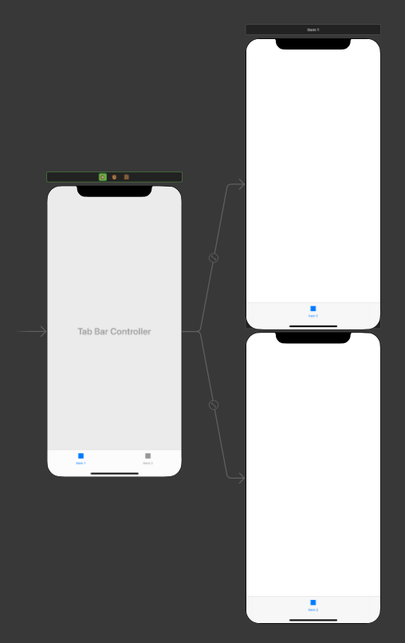
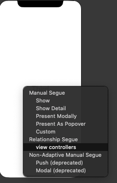
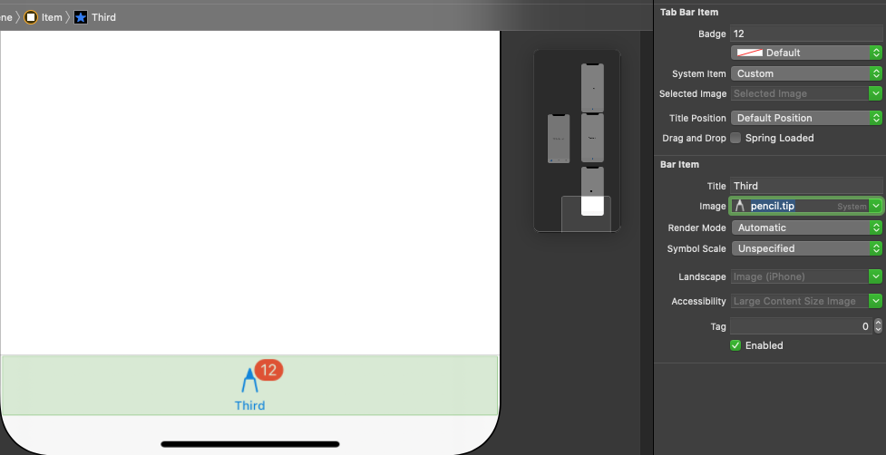
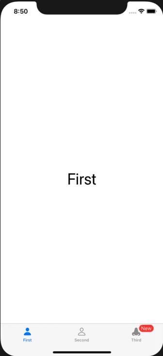

# UITabBarController

 

UITabBarController로 인스타그램처럼 밑에 화면들을 쉽게 교체 할 수 있게 한다.

## setup
1. drag drop tab **TabBarController** from Library at click **is initial view controller**
2. If you want to add another controller, drag drop view controller and connect it by pressing **Relationship Segue/view controllers** 


3. customize the tab bar buttons manually


## customize
Of course we can customize via storyboard like above, but we can do that also programmatically.

```tabBar```: tabBar is the tab bar itself. literally, the whole tab bar
```tabBar.items?[0]```: tabBar's first icon (first), and also, [1] will be the second, so on..

|methods|description|
|-|-|
|```tabBar.items?[0].title```|first tab bar items name|
|```tabBar.items?[0].image```|first tab bar items image|
|```tabBar.items?[0].badgeValue```|first tab bar item's badge and what it says in it|

### Example
```swift
class MyTabViewController: UITabBarController {

    override func viewDidLoad() {
        super.viewDidLoad()

        // 시작시 탭바를 세팅한다
        tabBar.items?[0].title = "First"
        tabBar.items?[1].title = "Second"
        tabBar.items?[2].title = "Third"
        
        tabBar.items?[0].image = UIImage(systemName: "person.fill")
        tabBar.items?[1].image = UIImage(systemName: "person")
        tabBar.items?[2].image = UIImage(systemName: "nose.fill")
        
        // 처음 시작할 때, 뱃지에 New를 활성화 시킨다.
        let tabBarItem = tabBar.items?[2]
        tabBarItem?.badgeValue = "New"
    }
}
```


---

## Interface

|type|description|
|-|-|
|```didSelect```|when pressed <br>input: ```item: UITabBarItem```|

By using fn above, will make the simple tab bar controller that does
> When the Thrid Tab bar button is pressed, it's badge will disappear.
```swift
import UIKit

class MyTabViewController: UITabBarController {

    override func viewDidLoad() {
        super.viewDidLoad()

        // 시작시 탭바를 세팅한다
        tabBar.items?[0].title = "First"
        tabBar.items?[1].title = "Second"
        tabBar.items?[2].title = "Third"
        
        tabBar.items?[0].image = UIImage(systemName: "person.fill")
        tabBar.items?[1].image = UIImage(systemName: "person")
        tabBar.items?[2].image = UIImage(systemName: "nose.fill")
        
        // 처음 시작할 때, 뱃지에 New를 활성화 시킨다.
        let tabBarItem = tabBar.items?[2]
        tabBarItem?.badgeValue = "New"
    }
    
    override func tabBar(_ tabBar: UITabBar, didSelect item: UITabBarItem) {
        // Third 탭이면, 뱃지를 지운다
        if item.title == "Third" {
            item.badgeValue = nil
        }
    }
}
```
