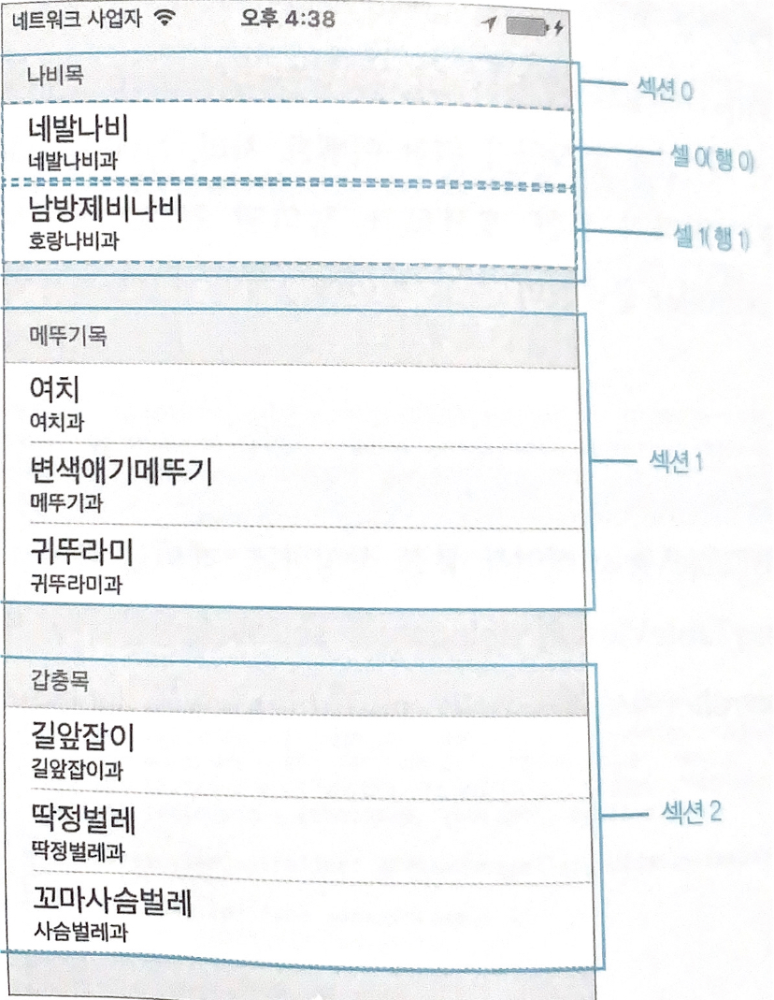
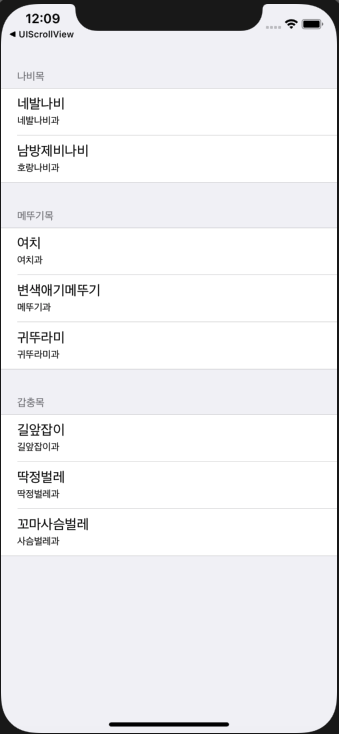

# UI Table View



**섹션 안에 행들** 이 있다, **Section > Row**

--- 

## setup

```swift
//
//  ViewController.swift
//  UITableView
//
//  Created by Dongha Kang on 2020/10/07.
//

import UIKit

let sectionTitle = ["나비목", "메뚜기목", "갑충목"]
let section0 = [("네발나비","네발나비과"), ("남방제비나비", "호랑나비과")]
let section1 = [("여치", "여치과"), ("변색애기메뚜기", "메뚜기과"), ("귀뚜라미", "귀뚜라미과")]
let section2 = [("길앞잡이", "길앞잡이과"), ("딱정벌레", "딱정벌레과"), ("꼬마사슴벌레", "사슴벌레과")]
let tableData = [section0, section1, section2]


class ViewController: UIViewController, UITableViewDelegate, UITableViewDataSource {
    
    override func viewDidLoad() {
        super.viewDidLoad()
        
        let myTableView = UITableView(frame: view.frame, style: .grouped)
        myTableView.dataSource = self
        myTableView.delegate = self
        view.addSubview(myTableView)
    }
}

// Data source
extension ViewController {
    func tableView(_ tableView: UITableView, numberOfRowsInSection section: Int) -> Int {
        let sectionData = tableData[section]
        return sectionData.count
    }
    
    func tableView(_ tableView: UITableView, cellForRowAt indexPath: IndexPath) -> UITableViewCell {
        let cell = UITableViewCell(style: .subtitle, reuseIdentifier: "cell")
        let sectionData = tableData[indexPath.section]
        let cellData = sectionData[indexPath.row]
        cell.textLabel?.text = cellData.0
        cell.detailTextLabel?.text = cellData.1
        return cell
    }
    
    func numberOfSections(in tableView: UITableView) -> Int {
        return sectionTitle.count
    }
    
    func tableView(_ tableView: UITableView, titleForHeaderInSection section: Int) -> String? {
        return sectionTitle[section]
    }
}

// Delegate
extension ViewController {
    func tableView(_ tableView: UITableView, didSelectRowAt indexPath: IndexPath) {
        let title = sectionTitle[indexPath.section]
        let sectionData = tableData[indexPath.section]  // 선택된 섹션 번호
        let cellData = sectionData[indexPath.row]       // 선택된 행 번호
        print("\(title)")
        print("\(cellData.1)")
        print("\(cellData.0)")
    }
}
```

|type|description|
|-|-|
|```cellForRowAt```|cell을 return하며, indexPath를 이용하여 어떤 셀이 들어가는지 보여준다 (required)|
|```numberOfSections```|섹션 갯수 (required)|
|```numberOfRowsInSection```|한 섹션 안에 행이 몇개가 있는지|
|```didSelectRowAt```|선택된 cell과 그 cell이 무엇을 하는지 (void)|
|```titleForHeaderInSection```|cell의 섹션 이름을 나타내며, 실제 Output에서 section 이름을 헤더에 보여준다.|

## Result

