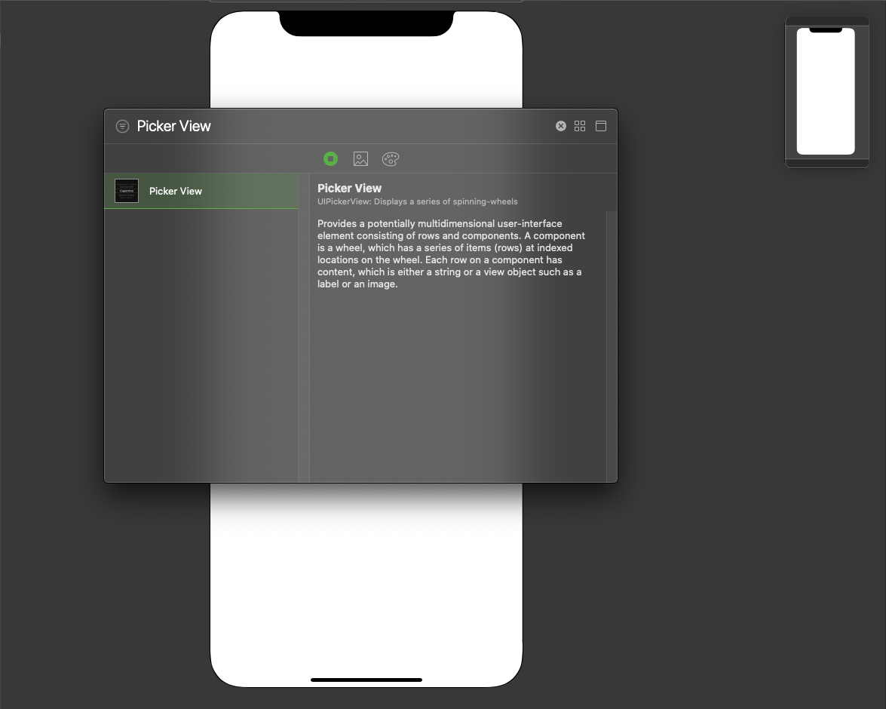
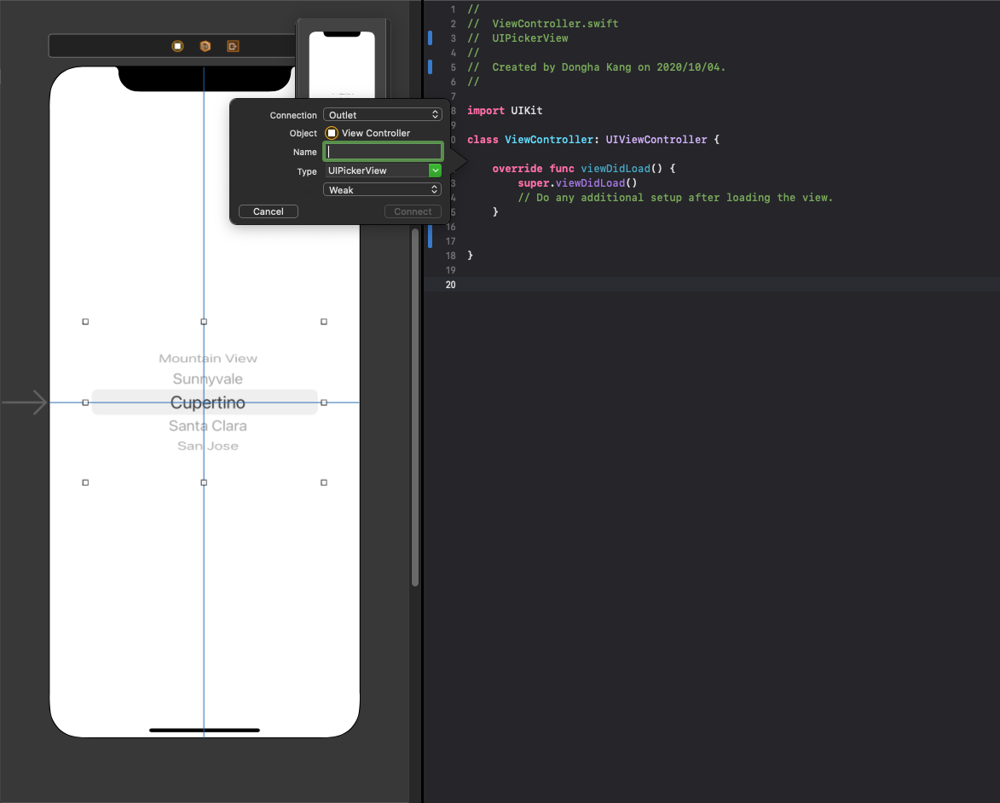
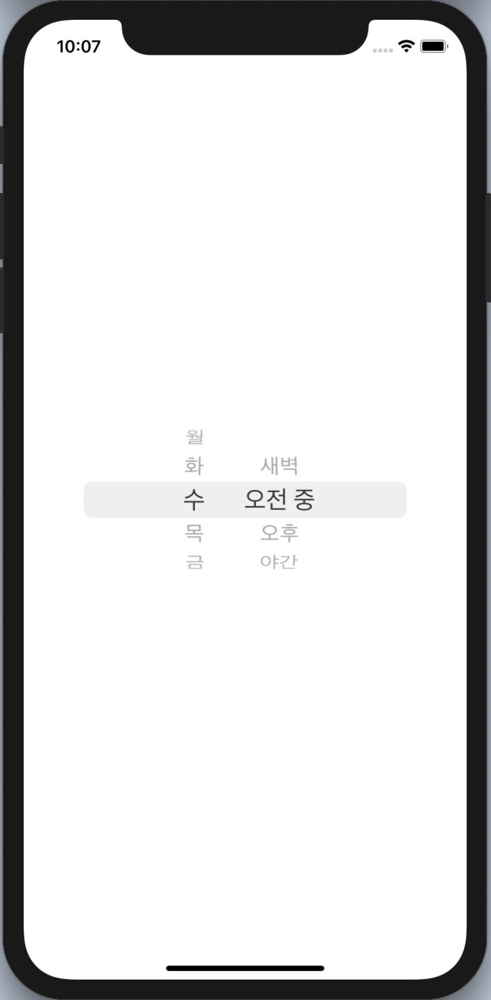

# UIPickerView


## setup 
**1.** Picker View를 라이브러리에서 배치하고, constraint를 설정해줍니다.
    
**2.** Picker View Outlet을 연결하고, Property를 선언해 연결합니다.
    

---
## Delegate, DataSource Protocol
**3.** Picker View 를 사용하려면, 이벤트 처리를 Delegate하기 위한 ```UIPickerViewDelegate```와 컴포넌트의 항복명을 설정하는 ```UIPickerViewDataSource```라는 Protocol을 사용합니다.
```swift
class ViewController: UIViewController, UIPickerViewDelegate, UIPickerViewDataSource {
    ...
}
```
Protocol의 선언이 끝나면, ```viewDidLoad()```에서, ```myPickerView``` Delegate와, ```myPickerView``` Data Source에 ```self```를 지정합니다.
```swift
override func viewDidLoad() {
    super.viewDidLoad()

    myPickerView.delegate = self
    myPickerView.dataSource = self
}
```
이 Protocol 선언은 에러를 초라하는데, 이 에러는, 다음과 같은 Method를 추가해줌으로 해결 할 수 있습니다.
```swift
func numberOfComponents(in pickerView: UIPickerView) -> Int {
    // 몇 개의 component가 있는지 return 하세요.
}
    
func pickerView(_ pickerView: UIPickerView, numberOfRowsInComponent component: Int) -> Int {
    // component에 들어갈 값을 이용하여, 그 값이 들어간 배열을 꺼내고, 무엇을 리턴 할 것인지 설정한뒤 숫자를 return 합니다.
}
```

---
## Create Picker View Component
Picker View에 표시할 항목명은 Component마다 Array로 만듭니다.
이 번에 만들 Picker View 에는 2개의 Component가 있으므로, 먼저 각 항목 명에 맞는 배열을 만들고, 2개의 배열을 ```compos```라는 Array에 넣어서 하나의 배열로 합칩니다.
```swift
let compos = [["월", "화", "수", "목", "금"], ["새벽", "오전 중", "오후", "야간"]]
```

```swift
func numberOfComponents(in pickerView: UIPickerView) -> Int {
    return compos.count
}
    
func pickerView(_ pickerView: UIPickerView, numberOfRowsInComponent component: Int) -> Int {
    let compo = compos[component]
    return compo.count
}
```
<br>
여러 개의 컴포넌트가 있으면, 컴포넌트의 너비를 지정합니다.
```swift
func pickerView(_ pickerView: UIPickerView, widthForComponent component: Int) -> CGFloat {
    if component == 0 {
        // 월 ~ 금
        return 50
    } else {
        // 시간대
        return 100
    }
}
```

<br>
Component에 표시할 항목명은 다음 메소드에서 차례로 꺼내 Picker View 에 설정합니다. compos 는 배열에 배열이 들어있는 2차원 배열이므로, compos[component][row]로 값을 꺼냅니다.
```swift
func pickerView(_ pickerView: UIPickerView, titleForRow row: Int, forComponent component: Int) -> String? {
    // 컴포넌트의 행에 항목명을 변환한다
    let item = compos[component][row]
    return item
}
```
---
## Read the Picker View Component
Drum 을 회전해 항목이 선택되면 다음 메소드가 호출되고, Component에 선택된 행과 컴포넌트 번호를 매개변수로 보냅니다.
```selectedRowInComponent()```를 사용하면, 컴포넌트에서 선택된 행을 알 수 있으며,
```pickerView(pickerView: titleForRow: )```를 사용하면 컴포넌트에서 현재 선택된 항목명을 확인 할 수 있습니다.
```swift
func pickerView(_ pickerView: UIPickerView, didSelectRow row: Int, inComponent component: Int) {
    let item = compos[component][row]
    print("\(item)가/이 선택됐습니다.")

    // 현재 선택된 행 번호
    let row1 = pickerView.selectedRow(inComponent: 0)
    let row2 = pickerView.selectedRow(inComponent: 1)
    print("현재 선택된 행 번호 \(row1), \(row2)")

    // 현재 선택된 항목명
    let item1 = self.pickerView(pickerView, titleForRow: row1, forComponent: 0)
    let item2 = self.pickerView(pickerView, titleForRow: row2, forComponent: 1)
    print("현재 선택된 항목명 \(item1), \(item2)")
}
```

---
## Final Product
```swift
import UIKit

class ViewController: UIViewController, UIPickerViewDataSource, UIPickerViewDelegate {
    @IBOutlet weak var myPickerView: UIPickerView!
    let compos = [["월", "화", "수", "목", "금"], ["새벽", "오전 중", "오후", "야간"]]
    
    override func viewDidLoad() {
        super.viewDidLoad()
        
        myPickerView.delegate = self
        myPickerView.dataSource = self
    }


    // Component 갯수,
    func numberOfComponents(in pickerView: UIPickerView) -> Int {
        return compos.count
    }
    
    // Component 항목 수
    func pickerView(_ pickerView: UIPickerView, numberOfRowsInComponent component: Int) -> Int {
        let compo = compos[component]
        return compo.count
    }
    
    // Component의 너비
    func pickerView(_ pickerView: UIPickerView, widthForComponent component: Int) -> CGFloat {
        if component == 0 {
            return 50
        } else {
            return 100
        }
    }
    
    // 선택한 컴포넌트, 행의 항목을 반환한다.
    func pickerView(_ pickerView: UIPickerView, titleForRow row: Int, forComponent component: Int) -> String? {
        let item = compos[component][row]
        return item
    }
    
    // 드럼을 회전하여, 항목 선택
    func pickerView(_ pickerView: UIPickerView, didSelectRow row: Int, inComponent component: Int) {
        let item = compos[component][row]
        print("\(item)가/이 선택됐습니다.")

        // 현재 선택된 행 번호
        let row1 = pickerView.selectedRow(inComponent: 0)
        let row2 = pickerView.selectedRow(inComponent: 1)
        print("현재 선택된 행 번호 \(row1), \(row2)")

        // 현재 선택된 항목명
        let item1 = self.pickerView(pickerView, titleForRow: row1, forComponent: 0)
        let item2 = self.pickerView(pickerView, titleForRow: row2, forComponent: 1)
        print("현재 선택된 항목명 \(item1), \(item2)")
    }
}

```

