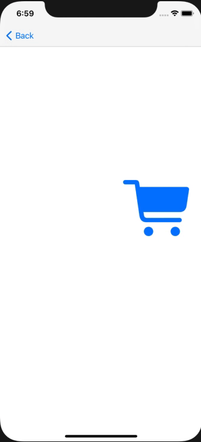

# Animation and Visual Effects

## Table of Contents

* [타이머를 사용한 애니메이션](#timer)
  * [Example](#example)
* [이즈 인 아웃 애니메이션](#ease-in-out)
  * [Example](#example)


## 타이머를 사용한 애니메이션
현재의 위치를 조금씩 변화시켜서 이동하는 것처럼 보이게 하는 애니메이션.
```swift
Timer.scheduledTimer(
    timeInterval: 0.1,                    // 반복할 간격(초)
    target: self,
    selector: #selector(self.function),   // 실행할 @objc 메소드
    userInfo: nil,
    repeats: true                         // 반복 재생
)
```

### Example
```swift
import UIKit

class FirstViewController: UIViewController {

    @IBOutlet weak var car: UIImageView!
    
    override func viewDidLoad() {
        super.viewDidLoad()
        
        // 타이머를 만든다
        Timer.scheduledTimer(timeInterval: 0.01, target: self, selector: #selector(self.step), userInfo: nil, repeats: true)
    }
        
    @objc func step() {
        // 수평 방향으로 이동
        car.center.x += 1
    
        // 오른쪽 가장자리에서 밖으로 나가면,
        let carWidth = car.bounds.width
        if car.center.x > (view.bounds.width + carWidth/2) {
            
            // 왼쪽끝의 바로 앞으로 되돌아간다.
            car.center.x = -carWidth
            
            // Y 좌표는 랜덤 높이로 변경한다.
            let viewH = view.bounds.height
            car.center.y = CGFloat(arc4random_uniform(UInt32(viewH)))
        }
    }
}
```




<br><br><br>

## 이즈 인 앤 아웃 
좌표, 투명도, 크기 등의 프로퍼티 설정값의 최종값을 지정해서 현재값을 서서히 변화시키는 편리한 메소드.
가속하면서 움직이고, 감속하면서 멈추는 이즈 인 아웃을 알아봅시다.

```swift
UIView.animate(
    withDuration: 1.0,                  // 1초 간격으로 재생
    delay: 0,                           // 기다리는 시간 0초 
    options: .curveEaseInOut,           // 이즈 인 아웃
    animations: {
        ...                             // 재생하는 애니메이션
    },
    completion: nil)                    // 끝나고 난 후 재생되는 것
```

|Animation type|description|
|-|-|
|```.curveEaseIn```|가속하며 움직임|
|```.curveEaseOut```|감속하며 멈춤|
|```.curveEaseInOut```|가속하며 움직인 뒤, 감속하며 멈춤|
|```.autoreverse```|반대로 재생|
|```.repeat```|반복하며 재생|
:key: 다수의 Animation type 을 사용할 수 있다. ```options: [.curveEaseInOut, .autoreverse, .repeat]```
