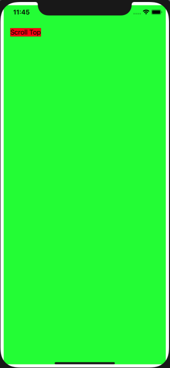
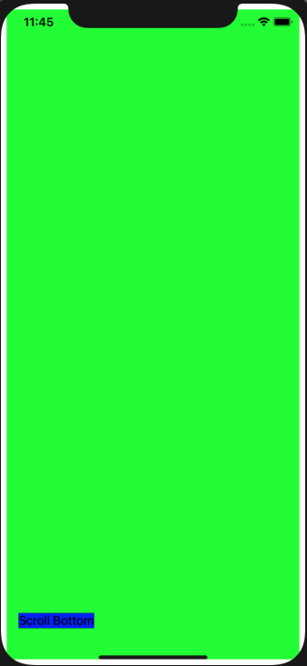

# UIScrollView
개인적으로, view controller 에서 하는거 보다, programmatically 하는것이 훨씬 나은거 같다.

---

## setup
```swift
import UIKit

class ViewController: UIViewController {

    /// - Scroll View를 부른다.
    let scrollView: UIScrollView = {
        let v = UIScrollView()
        v.translatesAutoresizingMaskIntoConstraints = false
        v.backgroundColor = .green
        return v
    }()
    
    let labelOne: UILabel = {
        let label = UILabel()
        label.text = "Scroll Top"
        label.backgroundColor = .red
        label.translatesAutoresizingMaskIntoConstraints = false
        return label
    }()

    let labelTwo: UILabel = {
        let label = UILabel()
        label.text = "Scroll Bottom"
        label.backgroundColor = .blue
        label.translatesAutoresizingMaskIntoConstraints = false
        return label
    }()

    
    override func viewDidLoad() {
        super.viewDidLoad()

        /// - scrollView 를 세팅한다. 
        self.view.addSubview(scrollView)
        
        let constraints = [scrollView.leftAnchor.constraint(equalTo: self.view.leftAnchor, constant: 8.0),
            scrollView.topAnchor.constraint(equalTo: self.view.topAnchor, constant: 8.0),
            scrollView.rightAnchor.constraint(equalTo: self.view.rightAnchor, constant: -8.0),
            scrollView.bottomAnchor.constraint(equalTo: self.view.bottomAnchor, constant: -8.0)]
        
        NSLayoutConstraint.activate(constraints)
        
        
        
        scrollView.addSubview(labelOne)
        scrollView.addSubview(labelTwo)
        
        labelOne.leadingAnchor.constraint(equalTo: scrollView.leadingAnchor, constant: 16.0).isActive = true
        labelOne.topAnchor.constraint(equalTo: scrollView.topAnchor, constant: 16.0).isActive = true
        
        labelTwo.leadingAnchor.constraint(equalTo: scrollView.leadingAnchor, constant: 16).isActive = true
        labelTwo.topAnchor.constraint(equalTo: scrollView.topAnchor, constant: 1000).isActive = true
        labelTwo.rightAnchor.constraint(equalTo: scrollView.rightAnchor, constant: -16.0).isActive = true
        labelTwo.bottomAnchor.constraint(equalTo: scrollView.bottomAnchor, constant: -16.0).isActive = true
    }
}
```
* ```scrollView```자체는 constraint가 특별하지 않다. 다만 그 안 부수기재의 위치에 따라서 scroll View로 변하는지 안 변하는지를 결정한다.

## Result


