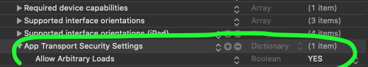
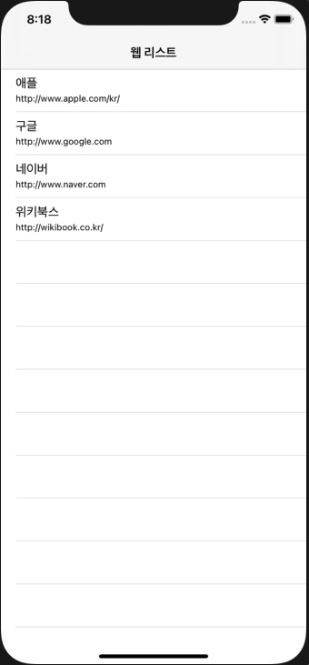

# Web View
This includs 
1. Separate Table View rows sending different data to the next activity
2. Web View using UIWebView

---

## Table View

### ```prepare```
prepare send the data to the next Storyboard.
```swift
override func prepare(for segue: UIStoryboardSegue, sender: Any?) {
    if segue.identifier == "toNext" {
        (segue.destination as! WebViewController).data = webData
    }
}
```
* ```"toNext"``` is segue identifier, not the view controller identifier. Make sure to connect it with the segue transition
* ```(segue.destination as! WebViewController)``` is the next view controller destination.
* ```(segue.destination as! WebViewController).data``` is the data that will pass from current view controller to ```WebViewController```

### ```performSegue```
This method calls the ```prepare``` method. Which occurs when the table view cell is selected (```didSelectRowAt```)
```swift
func tableView(_ tableView: UITableView, didSelectRowAt indexPath: IndexPath) {
    webData = webList[indexPath.row]
    performSegue(withIdentifier: "toNext", sender: self)
}
```

---

## WebView
Warning occurs saying 
>'UIWebView' was deprecated in iOS 12.0: No longer supported; please adopt WKWebView.

Just ignore at this moment. 

### setup info.plist


### in code

```swift
import UIKit

class WebViewController: UIViewController {
    @IBOutlet weak var webView: UIWebView!

    override func viewDidLoad() {
        super.viewDidLoad()

        openWeb()
    }
    

    func openWeb() {
        if let url = URL(string:"http://www.naver.com") {
            let urlReq = URLRequest(url: url)
            webView.loadRequest(urlReq)
        }
    }
}
```
This will open *http://www.naver.com* in set up UIWebView from storyboard.

---

## Overall

```swift
// View Controller

import UIKit

class ViewController: UIViewController, UITableViewDelegate, UITableViewDataSource {
    
    public static let identifier = "ViewController"

    // web list
    let webList = [
        (name:"애플", url:"http://www.apple.com/kr/"),
        (name:"구글", url:"http://www.google.com"),
        (name:"네이버", url:"http://www.naver.com"),
        (name:"위키북스", url:"http://wikibook.co.kr/"),
    ]
    
    // table view
    var myTableView = UITableView()
    
    var webData:(name:String, url:String)?
    
    override func viewDidLoad() {
        super.viewDidLoad()

        myTableView = UITableView(frame: view.frame)
        myTableView.dataSource = self
        myTableView.delegate = self
        view.addSubview(myTableView)
    }
    
    override func prepare(for segue: UIStoryboardSegue, sender: Any?) {
        if segue.identifier == "toNext" {
            (segue.destination as! WebViewController).data = webData
        }
    }
    
}

extension ViewController {
    func tableView(_ tableView: UITableView, numberOfRowsInSection section: Int) -> Int {
        return webList.count
    }
    
    func tableView(_ tableView: UITableView, cellForRowAt indexPath: IndexPath) -> UITableViewCell {
        let cell = UITableViewCell(style: .subtitle, reuseIdentifier: "cell")
        
        let webData = webList[indexPath.row]
        cell.textLabel?.text = webData.name
        cell.detailTextLabel?.text = webData.url
        
        return cell
    }
    
    func tableView(_ tableView: UITableView, didSelectRowAt indexPath: IndexPath) {
        webData = webList[indexPath.row]
        performSegue(withIdentifier: "toNext", sender: self)
    }
}
```

```swift
// WebView Controller.

class WebViewController: UIViewController {

    public static let identifier = "WebViewController"
    
    @IBOutlet weak var webView: UIWebView!
    var data:(name: String, url:String)?

    override func viewDidLoad() {
        super.viewDidLoad()
        navigationItem.title = data?.name
        openWeb()
    }
    

    func openWeb() {
        if let webData = data {
            if let url = URL(string:webData.url) {
                let urlReq = URLRequest(url: url)
                webView.loadRequest(urlReq)
            }
        }
    }
}

```


